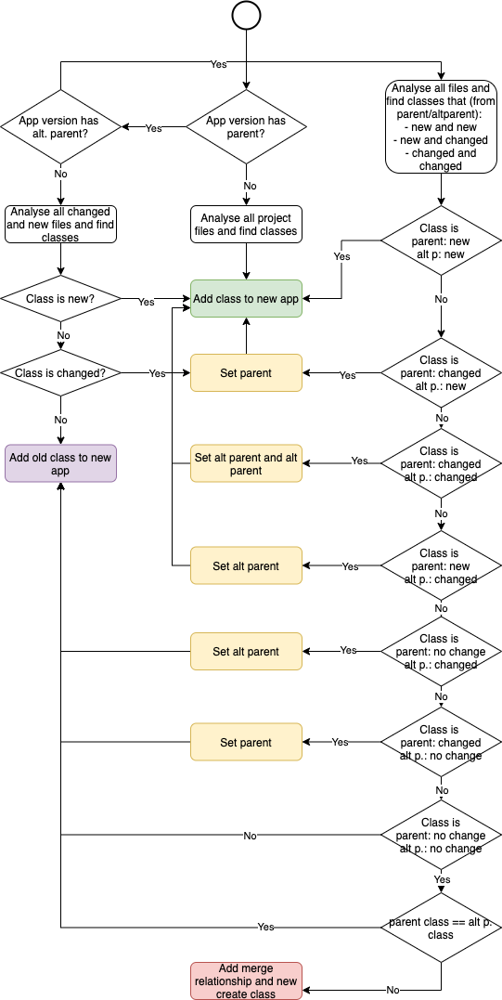

# Application analysis constroller

In the application analysis controller application versions are analysied. First the controller decides which files should be indexed, which new classes should be added, which classes have parent classes and which old classes belong to the new app version. This decision process is shown in the following figure.

