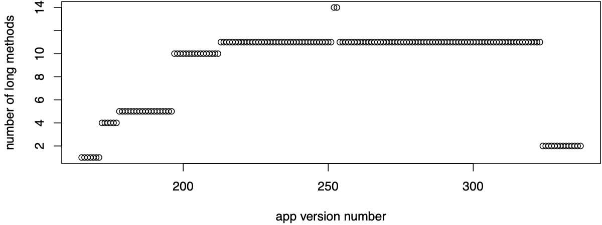

# Example queries 
We analysed 30 open source applications (including 3878 app versions - dataset can be found [here](../example_data/overview.md)) and ran through three example scenarios: 
- How did the number of long methods evolve in Tweetometer app?
- Did methods become too long over time?
- Can we find commits that removed vulnerabilities from code?

## How did the number of long methods evolve in Tweetometer app?

As an example we chose the Tweetometer app that has 373 analysed app versions. Of these app versions 173 are affected by a total of 19 long methods. We can query all long methods from the app Tweetometer with the following query:

    MATCH (app:App)-[:APP_OWNS_CLASS]->()
        -[:CLASS_OWNS_METHOD]->(method:Method) 
    WHERE 
        app.name = "Tweetometer" and 
        method.is_long_method = true 
    WITH 
        app, count(distinct method) as long_methods 
    RETURN 
        app.version_number as version, long_methods

We can then save the results as a .csv file and plot it using R. We can observe how the number of long methods grew in the first half of the project development, then plateaued. At the end almost all long methods were removed. The trend is shown in the following figure: 

## Did methods become too long over time?

To analyse if methods were created as long methods or if they became too long over time we can query the count of changes before a method became long method with the following query: 

    MATCH (m:Method) 
    WHERE 
        m.is_long_method = true
    OPTIONAL MATCH 
        p=(:Method)-[:CHANGED_TO*]->(m) 
    OPTIONAL MATCH 
        (m2)-[:CHANGED_TO]->(m) 
    WHERE 
        m2.is_long_method = true
    WITH 
        m, count(relationships(p)) as changes, m2 
    WHERE 
        m2 is null 
    RETURN count(*), changes

The result of this query shows that of 158 unique long method instances 131 methods were too long when they were added. Ten methods became too long after one and two changes, four became too long after three changes and one became too long after three, five and six changes. 

## Can we find commits that removed vulnerabilities from code?

We ran app analysis with the InsiderSecAnalyser enabled, which saved vulnerabilities into the application database as nodes and added relationships to vulnerable classes and methods. The following query finds commits that removed a vulnerability from a class:

    MATCH 
        (prev_app)-[:APP_OWNS_CLASS]->(c:Class)-[:HAS_VULNERABILITY]->(v:Vulnerability) 
    MATCH 
        (c)-[:CLASS_CHANGED_TO]->(c2)
                    <-[:APP_OWNS_CLASS]-(app:App)<-[:CHANGED_TO]-(prev_app)
    WHERE 
        NOT (c2)-[:HAS_VULNERABILITY]->() 
    RETURN 
        app.name, collect(distinct app.commit), count(v)

We found removed vulnerabilities in three application. In Arex application two vulnerabilities were removed in the same class during two commits. In iCepa application two vulnerabilities were removed in two different classes during two different commits. In Tweetometer application one vulnerability was removed. 
